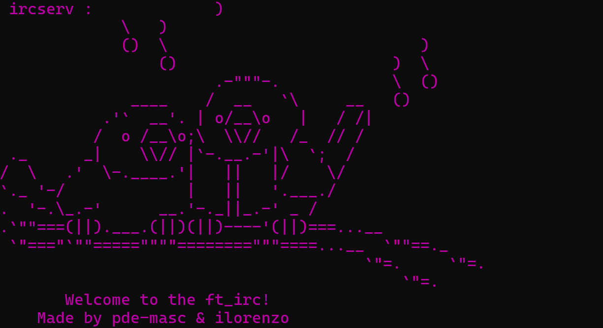

# ft_irc, creating an irc server

Creating and irc server using and an external irc client like HexChat or by simply using the nc command and the corresponding keywords to login into the irc protocol.
You can start the server using `make` and `./ircserv <port> <password>` with the port number on which your IRC server will be listening for incoming IRC connections and the connection password that will be needed by any IRC client that tries to connect to the server.

The commands applied to this irc server are:

`KICK` : Eject a client from the channel.

`INVITE` : Invite a client to a channel.

`TOPIC` : Change or view the channel topic.

`MODE` : Change the channel’s mode.

Using `MODE` you can adjust the parameters the admin finds necessary with the corresponding flags:

`i` : Set/remove invite-only channel.  
`t` : Restrict the `TOPIC` command to channel operators.  
`k` : Set/remove the channel key (password).  
`o` : Give/take channel operator privileges.  
`l` : Set/remove the user limit to the channel.

